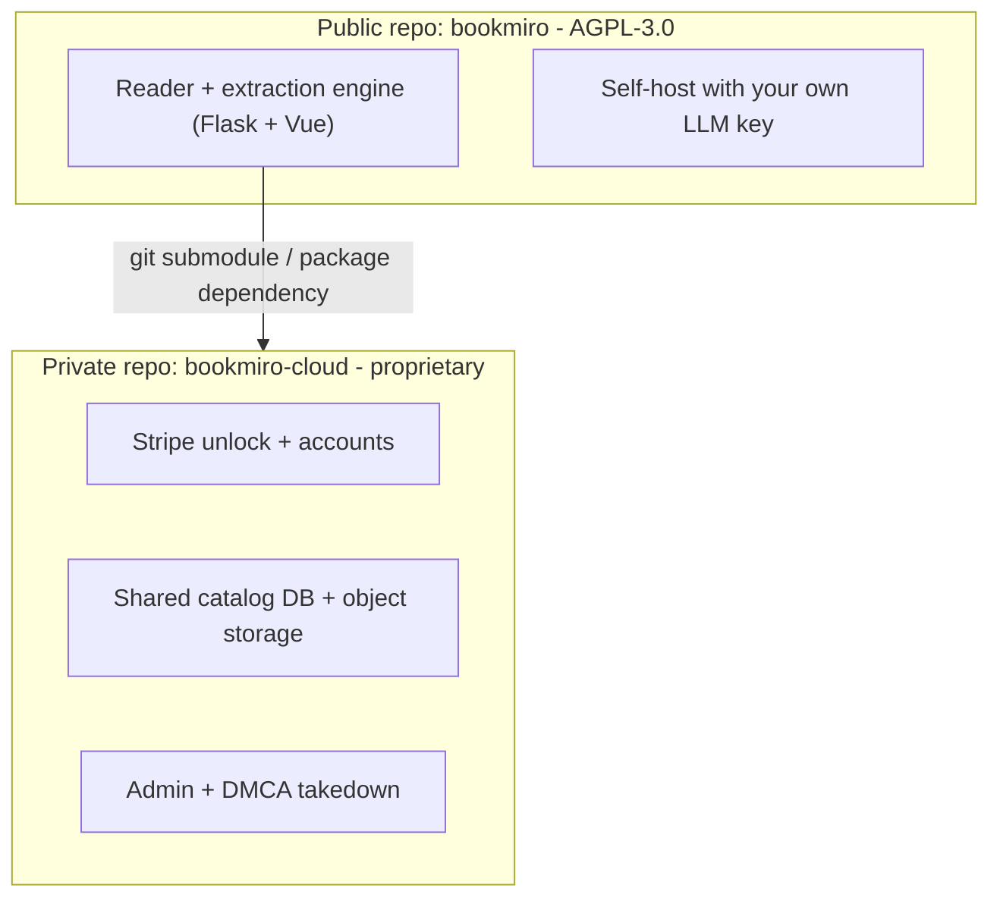
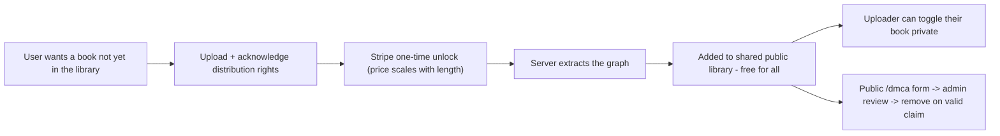

# BookMiro: Open-Source + Hosted Strategy

This document captures how BookMiro is structured as an open-source project with a hosted, paid site on top. It is a plan, not yet implemented (the current repo is the open-source app only).

> Legal note: the sections on payments, copyright, and DMCA below are a product/engineering plan, not legal advice. Have a lawyer review Terms of Service, Privacy Policy, and the DMCA process before launch.

## 0. Guiding principle: self-hosting always gets full functionality

The open-source repo is not a stripped-down trial of a hosted product - it **is** the product. Every reading/graph feature (reading-synced reveal, language-locked extraction, jump-to-source, edge reel, read-tracking, reverse linking) runs identically whether you use it on `localhost`, self-host it on your own server, or (eventually) use the hosted version. Nothing is gated behind a subscription.

| | Self-hosted (this repo, today) | Hosted SaaS (future, [section 2](#2-hosted-product-model-pay-once-then-free-for-everyone)+) |
|---|---|---|
| Reading/graph features | All of them | Same (identical app code) |
| Who provides the LLM key | You | The hosted service |
| Where books/graphs live | Local files on your machine/server | Shared Postgres + object storage |
| Users | Just you (single-tenant) | Accounts, multi-tenant |
| Cost | Your own LLM usage only | Pay-once-per-book unlock |
| Shared public library | No - your books are yours | Yes - unlocked books become free for everyone |
| Rights acknowledgment / DMCA takedown | Not applicable (private use) | Required (section 3) |

Concretely: everything under [section 4](#4-architecture-changes-needed-for-hosting) below (accounts, billing, shared catalog DB, admin/DMCA) is **additive infrastructure for running BookMiro as a shared paid service** - not a list of features missing from self-hosting. See **[SELF_HOSTING.md](./SELF_HOSTING.md)** for deployment instructions (local, Docker, Render, or any other host) and the full environment variable reference.

## 1. Repository structure (open-core)

Two repositories under the same GitHub org:

- **`bookmiro`** (public, this repo): the self-hostable app — reader UI, book segmentation, LLM graph extraction, lazy/streaming reveal. Anyone can run it with their own LLM key. License: **AGPL-3.0**.
- **`bookmiro-cloud`** (private): hosting-only layer — accounts, Stripe billing, shared catalog database, object storage, admin/DMCA tooling, and deployment/infra secrets. Depends on the public app (git submodule or an installed package). Proprietary.

### Why open-core (not one repo, not two unrelated repos)
- Keeps a genuinely useful OSS project (drives adoption, contributions, trust) while the monetizable hosting layer stays private.
- **AGPL-3.0 on the core** deters a competitor from taking the code and running a closed, hosted clone (AGPL requires them to publish their modifications). Since you are the copyright holder, AGPL does **not** restrict *you* from building a proprietary `bookmiro-cloud` on top.
- If you accept outside contributions, use a lightweight **CLA/DCO** so you retain the right to relicense / keep the commercial layer viable.

### Licensing summary
- Core (`bookmiro`): AGPL-3.0 (already declared in `package.json` / `pyproject.toml` / `LICENSE`).
- Cloud (`bookmiro-cloud`): proprietary, closed.
- Contributions: CLA or DCO on the public repo.

## 2. Hosted product model: pay once, then free for everyone

A book is created only when someone pays to unlock it. Once extracted, it enters the shared public library and is **free to read for everyone**. The uploader can toggle their book back to private.

### Free-rider consideration
Because the graph only exists after someone pays, the payer gets immediate value (instant access, optional name credit); everyone else benefits afterward. This is the intended "fund it once, share it forever" dynamic. Optional payer perks: contributor credit on the book page, early/instant access, ability to keep it private if they prefer.

## 3. Rights acknowledgment + DMCA-style takedown

Any uploaded book can become public, but the uploader must take responsibility for distribution rights, and there must be a takedown path.

- **Upload gate**: a required checkbox — "I confirm I have the rights to distribute this work, or it is rights-cleared / public domain." Store the acknowledgment with uploader id, timestamp, and IP.
- **Takedown channel**: a public `/dmca` form for rights holders to file a complaint (work, proof/【ownership statement】, contact, the URL). Store every notice.
- **Admin review**: an admin panel lists notices; when the complainant presents valid proof of ownership, an admin sets the book to `taken_down` (hidden from the public catalog; text + graph purged from serving).
- **Counter-notice**: allow the uploader to respond; restore if appropriate.
- **Safe harbor**: to rely on DMCA safe harbor (US), register a **designated DMCA agent** with the U.S. Copyright Office and publish the policy in the Terms of Service. Add a repeat-infringer policy.

## 4. Architecture changes needed for hosting

These are additions on top of the self-hosted app (see [section 0](#0-guiding-principle-self-hosting-always-gets-full-functionality)), needed only to run BookMiro as a shared, multi-tenant, paid service - not requirements for personal self-hosting (that's covered in [SELF_HOSTING.md](./SELF_HOSTING.md)).

The current app persists each book on the local filesystem via `backend/app/models/project.py` (`ProjectManager` writes `project.json`, `episodes.json`, `graph.json` under `uploads/`). Hosting a shared multi-user library needs shared, durable storage.

- **Database (Postgres)**: users, books (catalog + metadata), payments/unlocks, rights acknowledgments, DMCA notices, takedown status.
- **Object storage (S3-compatible)**: `graph.json`, `episodes.json`, extracted text. MVP alternative: a single server with a persistent volume + Postgres for metadata.
- **New book fields**: `visibility` (`public` | `private` | `taken_down`), `owner_id`, `rights_acknowledged` (+ who/when/IP), `content_hash` (dedup so the same book is not re-extracted or re-charged), `unlocked_by`, `char_count` / `episode_count` (for pricing).
- **Auth**: accounts for uploaders/payers; anonymous browsing and reading of the public library.
- **Payments**: Stripe Checkout, one-time unlock per book. Price scales with length to cover LLM extraction cost + margin. On `checkout.session.completed`, run extraction, then publish.
- **Cost / abuse guards**: length caps, rate limits, dedup by `content_hash`, and a per-book extraction budget.

## 5. Phased roadmap

1. **Rebrand** (done): MiroFish -> BookMiro, attribution to MiroFish's 红楼梦 demo.
2. **Split the cloud repo**: create private `bookmiro-cloud`; introduce Postgres + object storage; add `visibility` and a shared catalog.
3. **Accounts + payments**: auth, Stripe one-time unlock, length-based pricing, extract-on-payment.
4. **Rights + takedown**: upload acknowledgment gate, `/dmca` form, admin review + takedown, counter-notice.
5. **Launch prep**: Terms of Service, Privacy Policy, register DMCA agent, observability, backups, polish.

## 6. Open questions to confirm
- Final GitHub org/handle (placeholders currently use `666ghj/MiroFish`).
- Pricing per book (flat vs length-tiered) and target margin over LLM cost.
- Whether a book funded by the community can later be toggled private by its uploader (recommendation: allow private only if no one else has relied on it, or keep community-funded books public).
